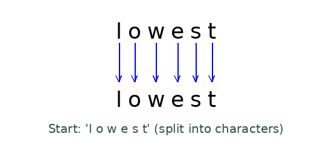

<div align="center">
  <h1 style="margin-bottom: 0;">Byte-Pair Encoding Tokenizer</h1>
  <h4 align="right"><i>From Scratch</i></h4>
</div>

<div align="center">
  <br>
  
  
  
</div>

## Overview

A robust implementation of Byte-Pair Encoding (BPE) tokenizer inspired by:

- [Stanford CS336 Course](https://online.stanford.edu/courses/cs336-language-modeling-scratch)
- [Philip Gage (1994)](http://www.pennelynn.com/Documents/CUJ/HTML/94HTML/19940045.HTM)
- [Sennrich et al. (2015)](https://arxiv.org/abs/1508.07909)
- [Radford et al. (2019)](https://cdn.openai.com/better-language-models/language_models_are_unsupervised_multitask_learners.pdf)

## Features:

- 🚀 Efficient encoding/decoding of text
- ⚙️ Special token handling
- 💾 Checkpointing during training
- 🔄 Resume training functionality
- 🧪 Comprehensive test suite
- 📦 Production-ready codebase

## Project Structure

```
bpe-tokenizer/
├── outputs/ # Training artifacts
│ ├── checkpoints/ # Training checkpoints
│ ├── merges.txt # Learned merge operations
│ └── vocab.json # Generated vocabulary
├── src/ # Core implementation
│ ├── bpe_tokenizer.py # Tokenizer class (encoding/decoding)
│ └── training_tokenizer.py # Training pipeline
├── tests/ # Comprehensive test suite
│ ├── fixtures/ # Test data
│ ├── adapters.py # Testing utilities
│ ├── common.py # Shared test components
│ ├── test_tokenizer.py # Tokenizer tests
│ └── test_train_bpe.py # Training tests
├── .github/workflows/ # CI/CD pipelines
├── LICENSE
├── README.md
├── pytest.ini # Test configuration
└── requirements.txt # Dependencies
```

## How Byte-Pair Encoding Works

<div align="center">
  <br>
  <em>Step-by-step merging of frequent pairs in Byte-Pair Encoding.</em>
</div>

Byte-Pair Encoding (BPE) is like teaching a computer to read by breaking words into familiar pieces.
Imagine you're learning a new language:

### Step 1: Start with the basics

- The computer begins knowing only individual letters: `a, b, c, ..., z` and common symbols

### Step 2: Find frequent partners

- It scans through all text looking for pairs of characters that often appear together:
  - `t + h = th` (very common in English)
  - `e + r = er` (common ending)

### Step 3: Create new building blocks

- When it finds frequent pairs, it creates new tokens:
  - `th` becomes a single unit instead of `t + h`
  - `er` becomes a single unit instead of `e + r`

### Step 4: Repeat and grow

- The process repeats, building more complex tokens:
  - `th + e` = `the` (very common word)
  - `c + at` = `cat` (common animal)
  - `pre + fix` = `prefix` (building complex words)

### Step 5: Build the vocabulary

- After many merges, we get:
  - Common words = single tokens (`the`, `cat`)
  - Rare words = multiple tokens (`hippopotamus` → `hippo` + `pot` + `amus`)
  - No unknown words!

## Installation

```
git clone https://github.com/mohammad-talaat7/bpe-tokenizer.git
cd bpe-tokenizer
pip install -r requirements.txt
```

## Usage

1. Training the Tokenizer

```python
from src.training_tokenizer import train_bpe

vocab, merges = train_bpe(
    input_path="your_data.txt",
    vocab_size=5000,
    special_tokens=["<|endoftext|>", "[PAD]"],
    num_processes=8
)
```

2. Using the Tokenizer

```python
from src.bpe_tokenizer import tokenizer

# Initialize tokenizer
tok = tokenizer.from_files(
    vocab_filepath="outputs/vocab.json",
    merges_filepath="outputs/merges.txt",
    special_tokens=["<|endoftext|>"]
)

# Encode text
encoded = tok.encode("Hello world!<|endoftext|>")
print(encoded)  # [123, 456, 789, 0]

# Decode tokens
decoded = tok.decode(encoded)
print(decoded)  # "Hello world!<|endoftext|>"
```

3. Command Line Training

```bash
python src/training_tokenizer.py \
  --input-path data/training_text.txt \
  --vocab-size 10000 \
  --special-tokens "<|endoftext|>,<|pad|>" \
  --num-processes 4 \
  --output-dir outputs/
```

4. Resuming Training

```python
from src.training_tokenizer import resume_bpe_training

vocab, merges = resume_bpe_training(
    checkpoint_path="outputs/checkpoints/checkpoint_500",
    target_vocab_size=15000
)
```

## Testing

Run the comprehensive test suite:

```bash
pytest tests/
```

Tests include:

- Tokenizer encoding/decoding roundtrips
- Special token handling
- Merge operations
- Vocabulary generation
- Edge case handling

## Core Components

- Tokenizer Class (bpe_tokenizer.py)

  - Efficient encoding/decoding
  - Special token preservation
  - Batch processing
  - Byte-level fallback for unknown tokens
  - Memory-efficient streaming

- Training Pipeline (training_tokenizer.py)
  - Parallel corpus processing
  - Frequency-based merge operations
  - Checkpointing system
  - Resume training capability
  - Vocabulary generation

## Key Features

- Robust Pre-tokenization: GPT-style regex pattern for initial segmentation
- Special Token Handling: Preserves special tokens during processing
- Efficient Merging: Optimized pair merging algorithm
- Error Resilience: Comprehensive logging and error handling
- Production Ready: Type annotations and documentation

## References

- Gage, P. (1994). A New Algorithm for Data Compression
- Sennrich et al. (2015). Neural Machine Translation of Rare Words
- Radford et al. (2019). Language Models are Unsupervised Multitask Learners
